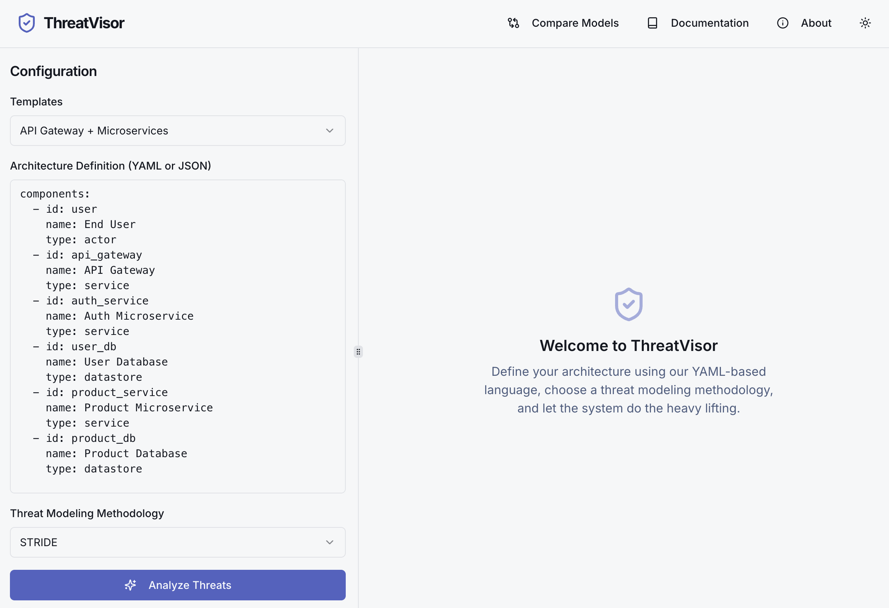
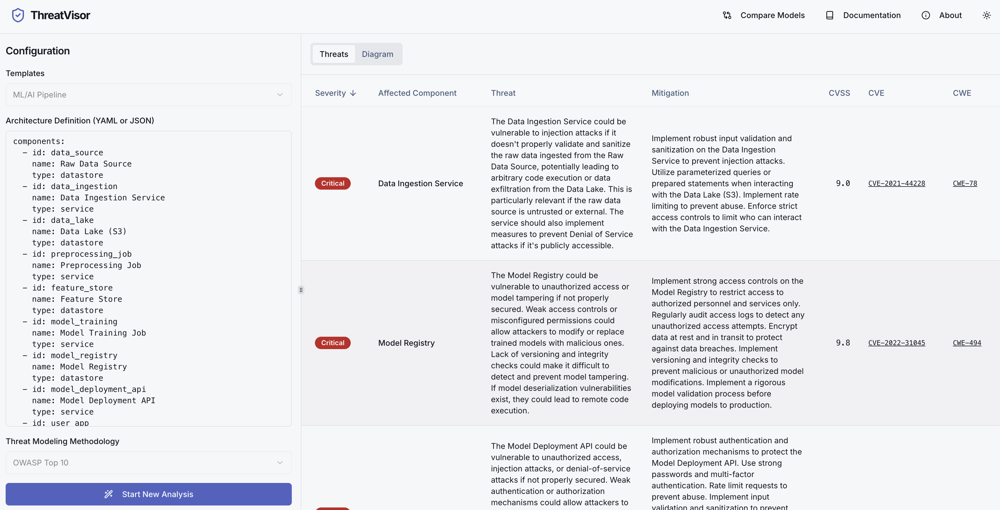
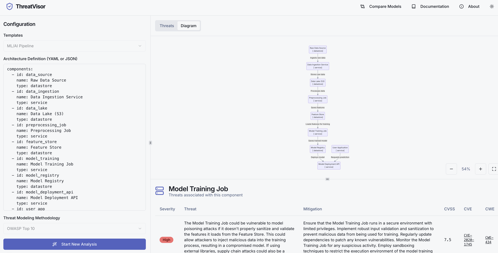
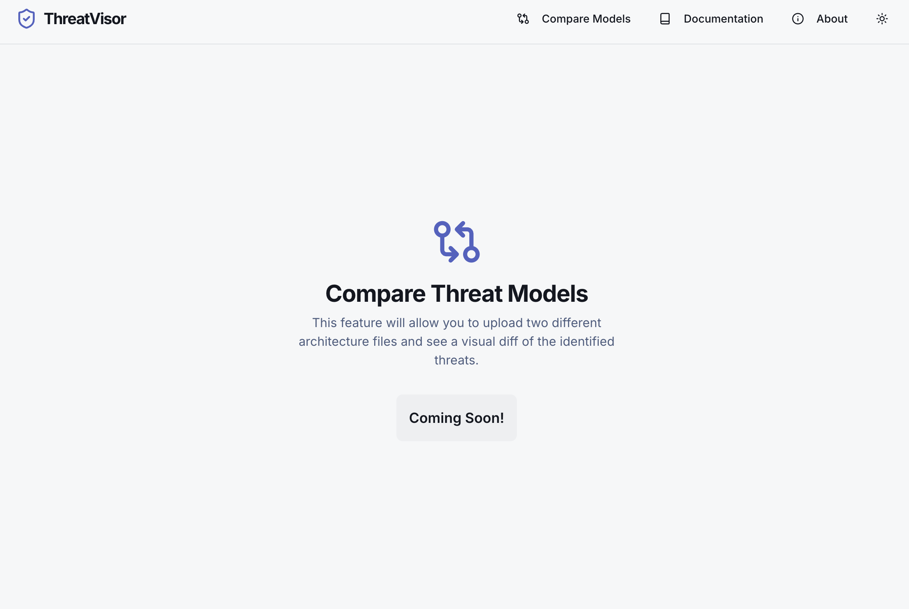

# ThreatVisor



This is a Next.js application for threat modeling as code.

To get started, take a look at `src/app/page.tsx`.

---

## Running Locally

You can run this application on your local machine for development or testing.

### Prerequisites

- [Node.js](https://nodejs.org/) (version 18 or later)
- [npm](https://www.npmjs.com/)

### Environment Setup

The core threat analysis feature requires a Google AI API key.

1.  Create a `.env` file in the root of the project (or rename the existing one).
2.  Get a free API key from [Google AI Studio](https://aistudio.google.com/app/apikey).
3.  Add the key to your `.env` file:

    ```
    GOOGLE_API_KEY=YOUR_API_KEY_HERE
    ```

### Installation & Running

1.  Install the project dependencies:

    ```bash
    npm install
    ```

2.  Start the development server:
    ```bash
    npm run dev
    ```

The application will be available at `http://localhost:3000`.

## Running with Docker

A `Dockerfile` is provided for building and running the application in a containerized environment.

### Build the Docker Image

From the root of the project, run the following command:

```bash
docker build -t threatvisor .
```

### Run the Docker Container

After building the image, you can run it as a container. You must provide your `GOOGLE_API_KEY` as an environment variable to the container.

```bash
docker run -p 3000:3000 -e GOOGLE_API_KEY="YOUR_API_KEY_HERE" threatvisor
```

The application will be accessible at `http://localhost:3000`.

### Here are some screenshots of the application:






